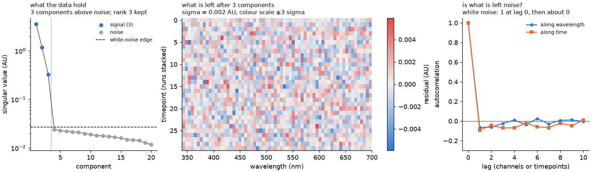
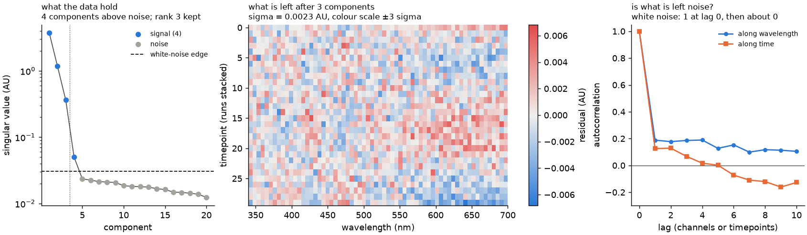

A UV/Vis time course is a mixture: at every time, the measured absorbance is the sum of
each species' concentration times its pure spectrum. Curve resolution splits the data
back into those two parts.

## Why you get a band, not a single answer

The data fix the **product** of concentrations and spectra, but usually not the split.
Mixing a little of one spectrum into another, and adjusting the concentrations to
match, reproduces the data exactly, and both spectra stay smooth and positive. No
amount of repeating the same measurement removes this; it is a property of the
experiment, not of the noise.

SpectraHandler therefore reports the **band**: for every concentration and every
spectrum value, the range over all splits that fit the data, widened by the
measurement noise. Its width is an honest statement of what your data can and cannot
tell you, provided that:

- the number of species you give is right,
- the noise is white and one level everywhere,
- the absorbance is concentrations times spectra and nothing else (no baseline or
  offset), and
- closure holds as given.

The range is explored by a random walk over the splits (hit-and-run), so the band is
an inner approximation that can fall slightly short of the true extremes, and the
noise margin is a linearised estimate. On every synthetic test so far the band
contained the true profiles and spectra.

Methods that return a single split (classic MCR-ALS, NMF), or a narrow Bayesian
posterior under a convenient prior, pick one point inside that band without telling
you that they did.

## What narrows the band

Only information the time course does not already contain:

- **Closure.** The species of one pool sum to a known total, e.g. 12.5 µM cobalamin.
  Taken from `initial_state`: every run sums to `initial_state[run].sum()`.
- **Reference spectra.** Every species you can measure pure pins its own spectrum.
- **Runs that change which species are present.** All runs share one set of pure
  spectra. A run in which a species is absent cuts the band markedly; a run that only
  changes the rates barely helps.

## A runnable example

```python
import jax
import jax.numpy as jnp

jax.config.update("jax_enable_x64", True)

from spectrahandler.curve_resolution import (
    SpectralDataset,
    make_realistic_dataset,
    resolve_band,
)

# Synthetic a -> b -> c data at 12.5 uM total, with known true spectra.
data, true_spectra, _ = make_realistic_dataset(jax.random.key(0))

# Suppose species "a" was measured pure: a 50 uM scan with 0.002 AU noise, divided
# by 50, gives its spectrum per uM with noise 0.002 / 50. Other species: NaN.
reference = jnp.full((3, data.n_wavelength), jnp.nan).at[0].set(true_spectra[0])
data = SpectralDataset.create(
    absorbance=data.absorbance,
    time=data.time,
    wavelength=data.wavelength,
    species=data.species,
    initial_state=data.initial_state,
    run_ids=data.run_ids,
    reference_spectra=reference,
    reference_sigma=jnp.array([0.002 / 50, jnp.nan, jnp.nan]),
)

band = resolve_band(data, jax.random.key(1))

print(f"{band.n_free} free re-mixing numbers, noise {band.sigma:.4f} AU")

# Only "a" has a reference, so only its name is pinned: the columns for "b" and "c"
# may come back swapped (see below).
lo, hi = band.concentration_lower[0, 10, 0], band.concentration_upper[0, 10, 0]
print(f"a at t = {float(data.time[0, 10]):.1f} h: {float(lo):.2f} - {float(hi):.2f} uM")
```

On this data species `a` at 3.4 h comes out between about 0.05 and 2.18 µM; the true
value is 1.58 µM.

## Reading the result

| Field | What it is |
| --- | --- |
| `concentration_lower`, `concentration_upper` | The band for every amount, in your concentration unit |
| `spectra_lower`, `spectra_upper` | The band for every spectrum value, in absorbance per concentration unit |
| `concentration_ambiguity`, `spectra_ambiguity` | The same extremes without the noise margin: the rotational ambiguity, still including the small noise slack allowed below zero |
| `concentration_draws`, `spectra_draws` | Draws spread evenly over all splits that fit, with noise. A *typical-solution* summary under a stated flat prior, not a calibrated interval |
| `n_free` | How many numbers the data leave undetermined |

Species **without** a reference are resolved only up to relabelling among themselves:
the band for "b" may be the spectrum you know as "c". Give a reference, or a run where
one of them is absent, to pin the names.

## Is the number of species right?

Every split in the band reproduces the data through the same best fit, so the fit
cannot tell splits apart. It can tell you whether the number of species is right:
after removing that many components, what is left should be plain noise.

```python
from spectrahandler.curve_resolution import noise_diagnostics
from spectrahandler.plot import plot_noise  # needs the plot extra: uv add "spectrahandler[plot]"

diagnostics = noise_diagnostics(data)
print(f"{diagnostics.n_above_noise} components above the noise edge")
plot_noise(diagnostics, data).savefig("noise.png")
```

On the example data this prints `3 components above the noise edge`, and the figure
looks like this:



- **Left, what the data hold.** Singular values above the dashed white-noise edge
  carry signal. Their count should equal your number of species.
- **Middle, what is left.** The residual after that many components, over time and
  wavelength. Even static is noise; stripes, steps or blobs are something the model
  is missing.
- **Right, is it noise?** The residual's autocorrelation. White noise is 1 at lag 0
  and about 0 after.

The same data with a slowly drifting offset added, which is one more component:



What to do with what you see:

- **More components above the edge than species:** an unmodelled species, a baseline,
  or a per-run offset. Each is one more component; the band assumes there are none.
- **Autocorrelation near 1 along wavelength:** the export was smoothed or interpolated
  along wavelength, as JASCO interval scans are. The noise level estimated from the
  data is then far too low; pass `sigma` measured along time on a stretch where
  nothing reacts.

## Tuning

`resolve_band` exposes its knobs with defaults that worked on synthetic data:

- `sigma`: the noise level. By default it is estimated from the data; pass a value
  measured on a blank if you have one.
- `z_slack`: how many noise standard deviations a value may dip below zero and still
  count as non-negative, and the width of the noise margin. Default 3.5.
- `n_iter`, `n_burn`, `thin`: length of the walk over the feasible region.
- `n_als`, `n_restart`, `n_search`: the search for a first split that fits.

Current limits: every run must be fully measured, the number of species is given, and
the noise is assumed to be one level everywhere.

## Reading JASCO exports

`spectrahandler.jasco` reads JASCO CSV exports into plain arrays. An interval-scan
export holds a whole run in one file; a run recorded as one file per timepoint, named
like `run1_15min.csv` or `run1_2h.csv`, is read with `read_spectrum_series`, which
orders the files by the time in their names. Either way you get a `Scan` with
`wavelength_nm`, `time_min` (always in minutes) and `absorbance` shaped
`(n_time, n_wavelength)`. `SpectralDataset.create` wants a leading run axis and times
in the dataset's time unit, hours by default:

```python
import jax
import jax.numpy as jnp

jax.config.update("jax_enable_x64", True)

from spectrahandler.curve_resolution import SpectralDataset
from spectrahandler.jasco import read_interval_scan, read_spectrum_series

scan = read_interval_scan("my_scan.csv")
# one file per timepoint: scan = read_spectrum_series(["run1_0min.csv", "run1_15min.csv"])

data = SpectralDataset.create(
    absorbance=jnp.asarray(scan.absorbance)[None],  # (1 run, n_time, n_wavelength)
    time=jnp.asarray(scan.time_min)[None] / 60.0,  # minutes -> hours
    wavelength=jnp.asarray(scan.wavelength_nm),
    species=("a", "b", "c"),
    initial_state=jnp.array([[12.5, 0.0, 0.0]]),  # uM at the start, one row per run
    run_ids=("run 1",),
    time_unit="h",
)
```

Several runs stack along the first axis with `jnp.stack`, and need the same wavelength
grid and the same number of timepoints. JASCO interval scans are interpolated along
wavelength, which fools the automatic noise estimate; see
[Is the number of species right?](#is-the-number-of-species-right) above.
