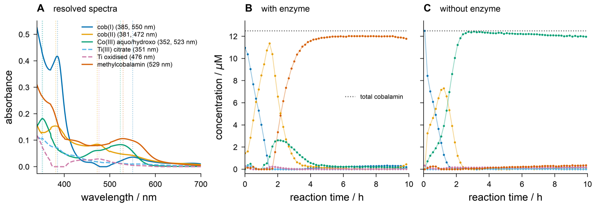

# Test data

Raw UV-Vis exports used for implementing and testing SpectraHandler. Everything here is
**untouched instrument output** — no trimming, no baseline subtraction, no resampling.
Derived matrices do not belong in this folder; if a test needs one, compute it.

Two experiments, two file layouts:

| Folder | Experiment | Layout |
|---|---|---|
| [`probe_a/`](probe_a) | Cobalamin methylation time course, 2026-08-26, four cuvettes | JASCO **interval scan** — one file, all timepoints |
| [`1a/`](1a) | Earlier cobalamin time course, 2026-08-12 | One file **per spectrum**, time in the filename |

Provenance: both came from `~/code/mcrals`, where an MCR-ALS fit was already run against
them. That fit is the reference result, not ground truth — see
[Reference result](#reference-result).

---

## File format A — JASCO V-730 interval scan

`probe_a/20260826_Probe_*.csv`. ASCII, **CRLF** line endings.

```
TITLE,Interval Scan Measurement      <- header block, `KEY,value`
DATA TYPE,ULTRAVIOLET SPECTRUM
ORIGIN,JASCO
DATE,2026/08/27
TIME,00:50:45
SPECTROMETER/DATA SYSTEM,JASCO Corp., V-730, Rev. 1.00
DELTAX,-1                            <- wavelength step, negative: counts DOWN
XUNITS,NANOMETERS
YUNITS,ABSORBANCE
FIRSTX,  800.0000
LASTX,  250.0000
NPOINTS,     551
FIRSTY/MAXY/MINY,...
XYDATA                               <- marker: the data block starts on the next line
,0,10.0167,20.0167, ... ,590.317     <- leading empty field, then acquisition TIMES
800,0.0172124,0.0254271, ...         <- one row per wavelength: wl, then one A per time
799,0.0172848,0.0254995, ...
...
250,0.365429,-0.138983, ...
```

Reading it:

1. Scan for the line `XYDATA`; everything before it is `KEY,value` metadata.
2. The **first** row after it is the time axis. Drop the leading empty field.
   **Times are in minutes**, despite nothing in the file saying so.
3. Every later row is `wavelength, A(t0), A(t1), ...`.
4. **Wavelengths descend** (800 → 250 nm). Sort ascending before doing anything.
5. The resulting matrix is `(n_wavelengths, n_times)` — transpose to the
   `(n_times, n_wavelengths)` orientation that deconvolution wants.
6. No footer block in this layout; the file ends at the last wavelength row.

All four files: 551 wavelengths (800→250 nm, 1 nm), 60 timepoints, ~10 min apart,
spanning ~9.8 h.

7. **The time axes are not aligned across the four runs.** They share a clock — all four
   files carry the same `DATE`/`TIME` header — but the cell changer visits the cuvettes
   in sequence, so each starts at its own offset:

   | Run | first read / min | cuvette slot |
   |---|---|---|
   | a | 0 | 1 |
   | c | 2.783 | 3 |
   | d | 4.183 | 4 |
   | f | 6.983 | 6 |

   ~1.4 min per slot step; slots 2 and 5 were not exported. Aligning the runs by row
   index rather than by recorded time silently shifts them by up to 7 min.
8. **The interval is not exactly uniform.** Nominally 10 min, but the changer jitters up
   to ±0.3 min late in a run (Probe f, after ~7.5 h, alternates 10.28 / 9.73). Interpolate
   from the recorded times; never rebuild the axis as `arange(60) * 10`.

## File format B — JASCO single spectrum

`1a/1a_*.csv` and `probe_a/20260827_Puffer_background.csv`. Same header block, same
`XYDATA` marker, but the data is plain two-column `wavelength,absorbance` — and there is
a **trailing instrument-parameter block** after a blank line:

```
XYDATA
700.0000,0.121191
699.5000,0.121509
...
300.0000,0.874
                                     <- blank line ends the data
Light source,D2/WI                   <- footer: bandwidth, scan speed, accumulations, ...
Correction,Baseline
No. of accumulations,2
```

Stop reading data at the first blank line, or at the first row that does not parse as two
floats. 0.5 nm step here, not 1 nm.

**Acquisition time lives in the filename**, not in the file: `1a_0h`, `1a_15min`,
`1a_30min`, `1a_1h`, `1a_2h`, `1a_4h`, `1a_20h`. The units are mixed; normalise them.
Do not sort these by filename — lexical order puts `15min` before `1h`.

---

## Experimental conditions

### `probe_a/` — 2026-08-26

Reduction of hydroxocobalamin by Ti(III) citrate, and its methylation. Four cuvettes ran
together in the cell changer, each read every ~10 min for ~10 h. They do **not** share a
time origin — see point 7 above.

| File | Contents | Role |
|---|---|---|
| `20260826_Probe_a.csv` | enzyme + hydroxocobalamin + Ti(III) citrate | **full assay** |
| `20260826_Probe_d_hydroxycobalamin+titancitrate.csv` | hydroxocobalamin + Ti(III) citrate | no enzyme |
| `20260826_Probe_c_titancitrate-only.csv` | Ti(III) citrate | reductant alone |
| `20260826_Probe_f_only_enzyme.csv` | enzyme | enzyme alone |
| `20260827_Puffer_background.csv` | buffer | blank, recorded the **next day** |

- **Total cobalamin 12.5 µM** — 25 µM hydroxocobalamin diluted 2:1. This is the closure
  constraint: the cobalamin-bearing species must sum to it.
- Six species resolve out: cob(I), cob(II), Co(III) aquo/hydroxo, methylcobalamin,
  Ti(III) citrate, oxidised Ti.
- Path length **assumed** 1 cm (the file does not record it).

### `1a/` — 2026-08-12

An earlier cobalamin time course, 7 spectra from 0 h to 20 h, 700→300 nm at 0.5 nm.

**This dataset deliberately fails QC.** It is kept as a negative fixture: it saturates
(`MAXY` reads 10.0 AU), so it is not linear in concentration and violates the bilinearity
that every deconvolution method assumes. Use it to test that checks fire, not to test that
fits succeed.

---

## Traps in this data

Each of these produced a wrong answer at least once. They are the reason the fixtures are
worth keeping.

- **Wavelength-interpolated export.** The interval-scan files are smoothed/interpolated
  along wavelength, so neighbouring channels are not independent. Estimating noise along
  the wavelength axis reads roughly 300× too low and silently disarms every
  residual-based check. **Estimate noise along time**, over a stretch where nothing is
  reacting (750–800 nm works).
- **The deep UV is instrument baseline, not sample.** Buffer alone reads about
  −0.194 AU at 250 nm. Anything below ~340 nm is dominated by that artefact; selecting or
  weighting spectra on it selects on the instrument.
- **355 nm is the reductant, not the cobalamin.** The 355 nm decay correlates with the
  Ti(III)-citrate-only control at 0.981. Assigning it to cobalamin chemistry is the
  easiest mistake in this dataset.
- **Subtracting a non-empty baseline window invents a species.** If the window holds a
  real, time-varying band, the subtraction injects an artefact that any bilinear
  decomposition will happily turn into a confident-looking fictitious component. Prefer
  carrying scattering as an explicit component.
- **Probe a has a baseline discontinuity near 4.5 h.** Unhandled, it looks like chemistry.
- **Staggered starts and a jittering interval.** Points 7 and 8 above. Both are easy to
  paper over with an assumed uniform grid, and both then show up as phantom kinetics.
- **Each cuvette carries its own offset and scattering trajectory.** Those are per-run
  nuisance terms, not shared chemistry; left in, the runs cannot share one set of pure
  spectra.
- **`1a` saturates.** See above.

## Reference result



Produced by `~/code/mcrals` (`examples/figure_probe_a.py`): six components, runs a/c/d
stacked column-wise to force one shared set of pure spectra, closure at 12.5 µM over the
four cobalamin-bearing components, noise estimated along time.

Panel A is the resolved spectra, B the full assay, C the no-enzyme control. Both panels
show cob(I) decaying, cob(II) rising and falling, and methylcobalamin accumulating to
~12 µM — but the enzyme changes the route: without it, Co(III) aquo/hydroxo carries the
end state instead.

Treat this as **a plausible prior answer to reproduce and argue with**, not as ground
truth. It is an MCR-ALS fit and carries rotational ambiguity; SpectraHandler exists partly
to put credible intervals on exactly these numbers.

## Not recorded here

Fill these in when known — they are needed for any quantitative claim:

- [ ] Enzyme identity, concentration, and batch
- [ ] Buffer composition and pH
- [ ] Ti(III) citrate concentration
- [ ] Temperature
- [ ] Cuvette path length (1 cm assumed)
- [ ] Whether `1a` and `probe_a` share a cobalamin stock
